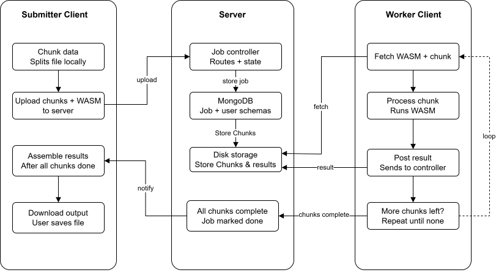

# Chorus

**A Distributed WebAssembly Compute Platform**

[](https://reactjs.org/)
[](https://nodejs.org/)
[](https://webassembly.org/)
[](https://mongodb.com/)

*A system designed to harness idle browser computation resources for the execution of parallel, heavy-duty computational tasks.*

---

## 1. Overview

**Chorus** is a highly efficient distributed computational platform that utilizes WebAssembly (WASM) to process extensive workloads in parallel across multiple client environments. Instead of relying exclusively on centralized server infrastructure, Chorus automatically divides large computational tasks into smaller segments (chunks) and distributes them to connected web browser workers. Upon completion, the system aggregates the results to produce the final output.

This architecture enables organizations and research institutions to conduct computationally intensive operations in a cost-effective and scalable manner by leveraging distributed processing capabilities.

---

## 2. Use Cases and Applications

Chorus is specifically engineered for highly parallelizable tasks requiring substantial computational resources. Target application domains include:

- **Bioinformatics and Protein Synthesis**: Execution of simulations for protein folding (e.g., Folding@home equivalent processing), DNA sequence alignment, and comprehensive genomic data analysis.
- **Monte Carlo Simulations**: Advanced risk analysis, financial modeling, and complex physics simulations that require extensive random sampling iterations.
- **Cryptography**: Distributed hashing procedures, cryptographic algorithm validation, and related research operations.
- **Machine Learning**: Parallel execution of data preprocessing, hyperparameter optimization, and federated learning workflows.
- **Image and Video Rendering**: Distributed ray tracing, 3D model rendering, and parallelized frame-by-frame video processing.
- **Scientific Research**: Execution of astrophysical simulations, climate modeling, and generation of complex fractal geometries.

---

## 3. Key Features

- **Distributed WASM Execution**: Compiles and executes high-performance routines at near-native speeds directly within the browser environment.
- **Dynamic Workload Distribution**: Automatically partitions large-scale tasks into manageable data chunks to ensure seamless parallel execution.
- **Fault Tolerance and Redundancy**: Incorporates automated recovery mechanisms (via the Chunk Reaper service) to reassign incomplete tasks in the event of worker disconnection or failure.
- **Custom Result Assembly**: Provides support for customizable JavaScript-based Assembly scripts to systematically reconstruct completed data chunks.
- **Security and Access Control**: Implements robust session-based authentication, cryptographic job passwords, and strict rate-limiting protocols.
- **Modern User Interface**: Features a responsive, intuitive frontend developed using React, Tailwind CSS, and shadcn/ui.

---

## 4. System Architecture

### 4.1. Sequence Diagram



### 4.2. Directory Structure

```text
Chorus/
├── client/                 # React Frontend Application
│   ├── src/
│   │   ├── components/ui/  # User Interface Components
│   │   ├── pages/          # Core View Controllers (Worker, Submitter, Dashboard)
│   │   ├── utils/          # WASM Execution Engine and API Utilities
│   │   └── index.css       # Core Styling Configurations
│   ├── package.json
│   └── vite.config.js
├── server/                 # Node.js and Express Backend Server
│   ├── src/
│   │   ├── controllers/    # API Route Processing Logic
│   │   ├── models/         # Database Schemas (Job, User, Chunks)
│   │   ├── services/       # Background Services (Chunk Reaper, Assembly)
│   │   └── index.js        # Server Application Entry Point
│   └── package.json
├── test_files/             # Sample datasets and compiled WASM binaries for validation
├── .docs/                  # Documentation assets
├── REFINEMENTS.md          # Implementation roadmap and system refinements
└── README.md               # Primary project documentation
```

---

## 5. Deployment Guide

### 5.1. Prerequisites

Please ensure the following dependencies are installed within your environment prior to setup:
- **Node.js** (Version 18.0.0 or higher)
- **MongoDB** (Local instance or MongoDB Atlas)
- **npm** or **yarn** package manager

### 5.2. Backend Configuration

Navigate to the server directory to install necessary dependencies and configure the environment:

```bash
cd server
npm install

# Initialize environment variables
echo "MONGO_URI=mongodb://127.0.0.1:27017/chorus" > .env
echo "SESSION_SECRET=your_secure_session_secret" >> .env
echo "PORT=5000" >> .env

# Initialize the development server
npm run dev
```

### 5.3. Frontend Configuration

Navigate to the client directory and initialize the Vite development server:

```bash
cd client
npm install

# Initialize the frontend server
npm run dev
```

### 5.4. Operational Verification

1. Access the application via a supported web browser at `http://localhost:5173`.
2. Register an account and authenticate.
3. Navigate to the **Submit** interface to upload a validation job from the `test_files/` directory.
4. Open a secondary browser session (to act as a worker node) and proceed to the **Browse Jobs** section.
5. Select **Start Processing** to initialize distributed execution.

---

## 6. Contribution Guidelines

Contributions to the codebase are encouraged. For developers seeking to contribute, please refer to the `REFINEMENTS.md` document for a prioritized backlog of system enhancements, including:
- In-flight chunk timeout management and automated release protocols.
- Advanced WASM module caching mechanisms.
- Implementation of Server-Sent Events (SSE) for real-time telemetry.

### 6.1. Standard Workflow

1. **Fork** the repository.
2. **Create** a feature branch (`git checkout -b feature/FeatureName`).
3. **Commit** your modifications (`git commit -m 'Implement FeatureName'`).
4. **Push** to the specified branch (`git push origin feature/FeatureName`).
5. **Open** a Pull Request for review.

---

## 7. License

This project is distributed under the MIT License. Please consult the `LICENSE` file for full regulatory details.